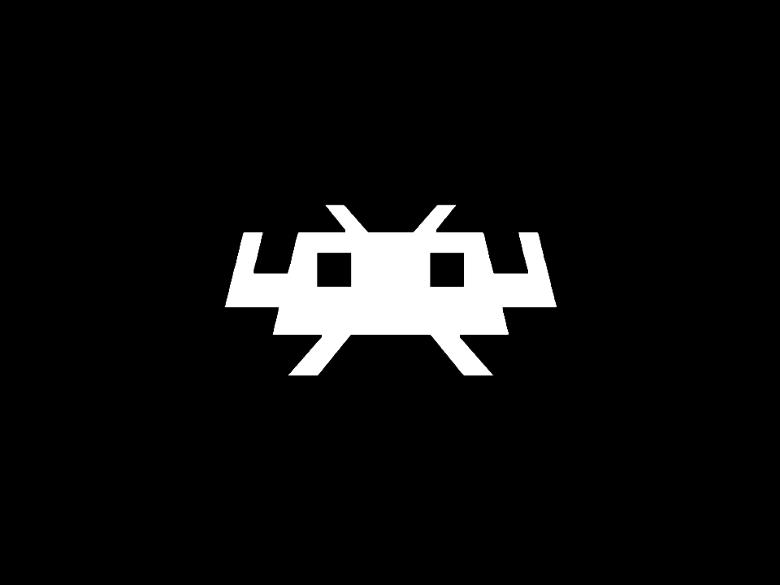

# Retroarch in Docker Container

## Changes from original project (docker-steam-headless):
- Ubuntu 22.10 based
- Added RetroArch (supervized)
- Migrated to new Sunshine branch (from LizardByte)
- Deleted: SSH/Steam/dind

### USING HOST X SERVER:
If your host is already running X, you can just use that. To do this, be sure to configure:
  - DISPLAY=:0    
    **(Variable)** - *Configures the sceen to use the primary display. Set this to whatever your host is using*
  - MODE=secondary    
    **(Variable)** - *Configures the container to not start an X server of its own*
  - HOST_DBUS=true    
    **(Variable)** - *Optional - Configures the container to use the host dbus process*
  - /run/dbus:/run/dbus:ro    
    **(Mount)**  - *Optional - Configures the container to use the host dbus process*

---
## Installation:
- [Docker Compose]

> services:
>   retroarch:
>     image: retroarch101:latest
>     container_name: retroarch101
>     restart: unless-stopped
>     runtime: runc
>     ## NOTE: Requires privileged access to host to be able to access the required devices
>     privileged: true
>     shm_size: 2G
>     ipc: host # Could also be set to 'shareable'
>     ulimits:
>       nofile:
>         soft: 1024
>         hard: 524288
>     network_mode: host
>     hostname: retroarch101
>     extra_hosts:
>       - "retroarch101:127.0.0.1"
>     environment:
>       - NAME=retroarch101
>       - TZ=***
>       - USER_LOCALES=en_US.UTF-8 UTF-8
>       - DISPLAY=:55
>       - PUID=1000
>       - PGID=1000
>       - UMASK=000
>       - USER_PASSWORD=password
>       - MODE=primary
>       - WEB_UI_MODE=vnc
>       - ENABLE_VNC_AUDIO=true
>       - PORT_NOVNC_WEB=8083
>       - ENABLE_SUNSHINE=true
>       - SUNSHINE_USER=***
>       - SUNSHINE_PASS=***
>       - ENABLE_EVDEV_INPUTS=true
>       - NVIDIA_DRIVER_CAPABILITIES=all
>       - NVIDIA_VISIBLE_DEVICES=all
> 
>     volumes:
>       # The location of your home directory.
>       - ./retroarch/home/:/home/default/:rw
>       # Input devices used for mouse and joypad support inside the container.
>       - /dev/input/:/dev/input/:ro
>       # The Xorg socket. This will be shared with other containers so they can access the X server.
>       - ./retroarch/.X11-unix/:/tmp/.X11-unix/:rw
>       # Pulse audio socket. This will be shared with other containers so they can access the audio sink.
>       - ./retroarch/pulse/:/tmp/pulse/:rw
>        # Persistent storage for retroarch configs/cores/etc
>       - ./retroarch/retroarch/:/home/default/.config/retroarch/
>        # The location with games
>       - /mnt/Vault101_2/Games101/:/mnt/Games/:ro 

---
## TODO:
- More refactoring
- HW Acceleration of Sunshine encoding
- Different images for different GPUs
- Proper version arguments
